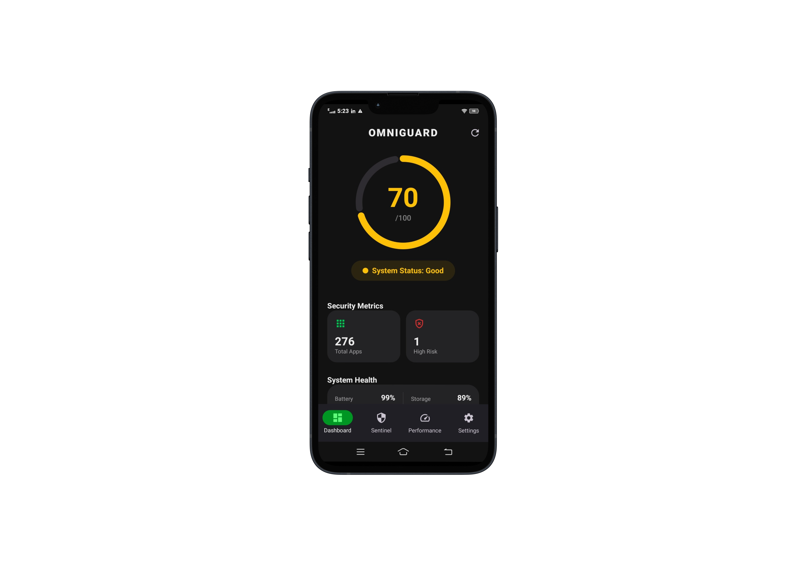
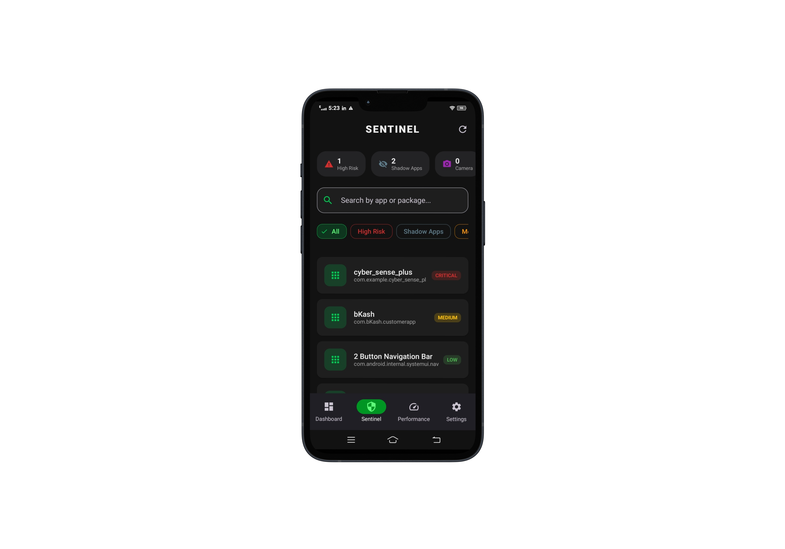
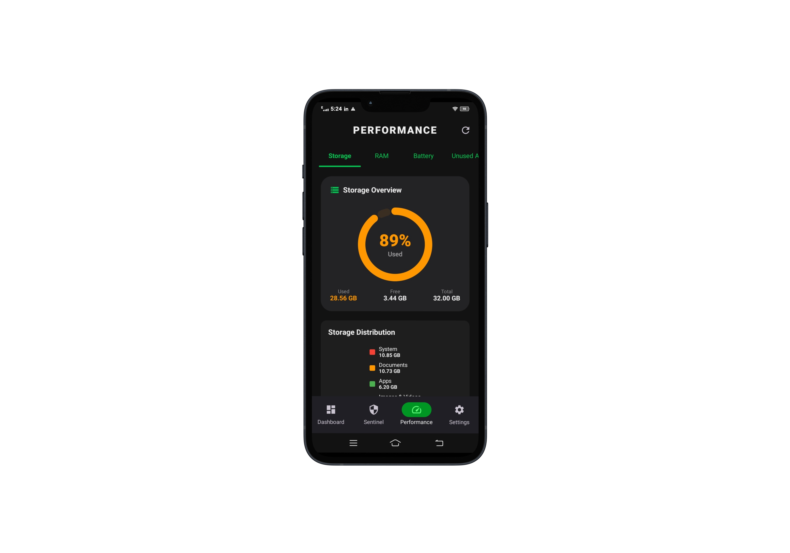
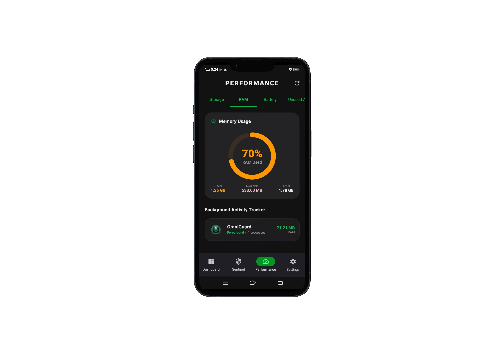
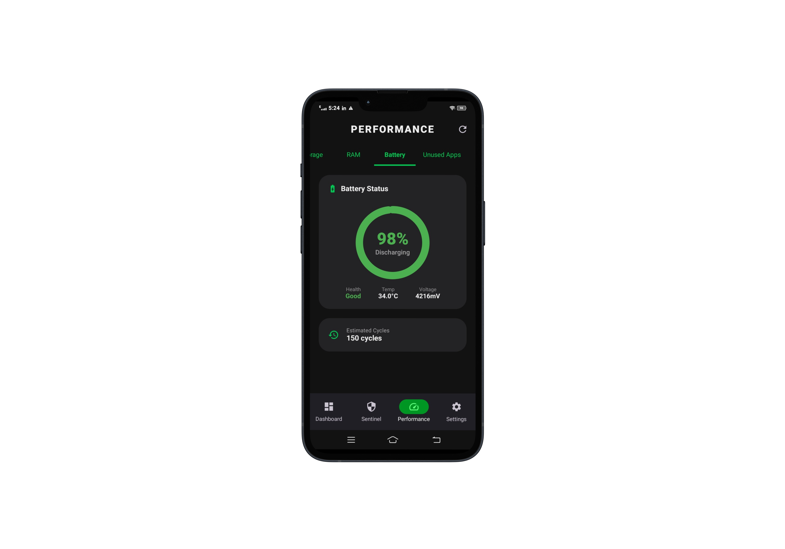
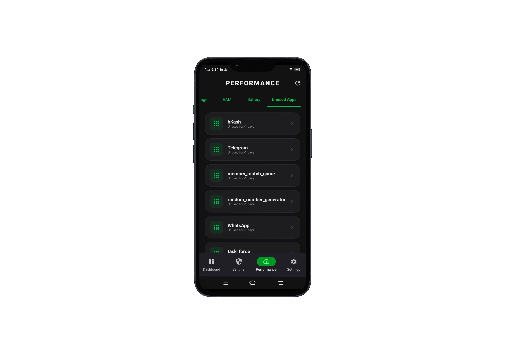
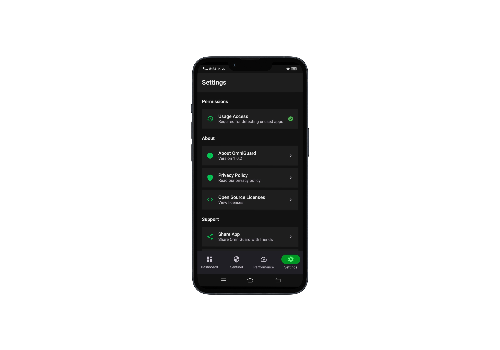
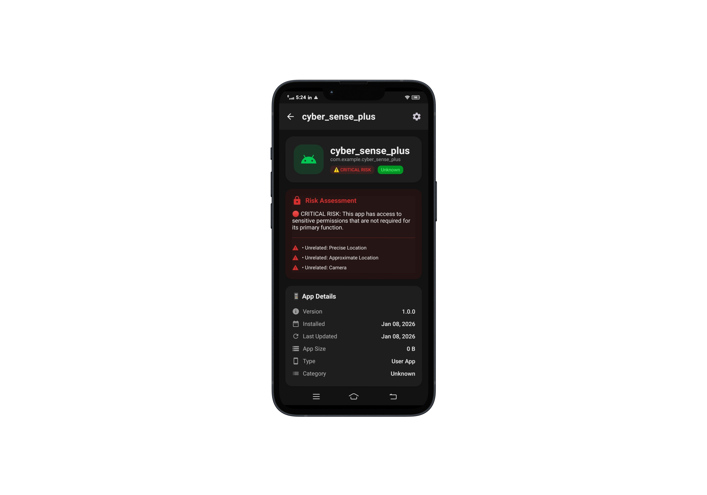
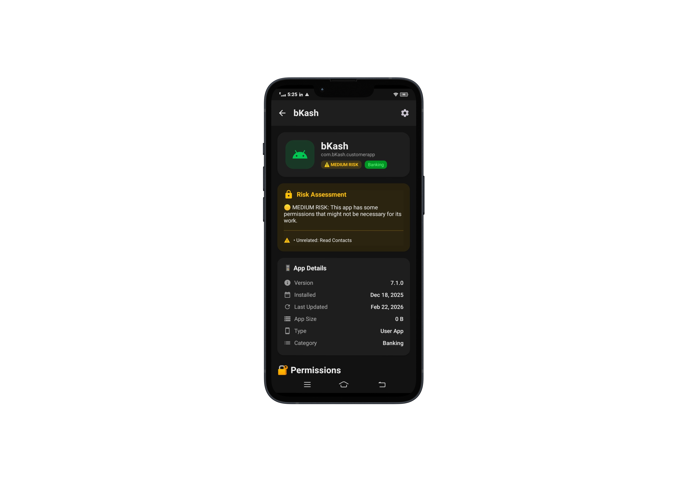

# 🔒 OmniGuard - Privacy Dashboard for Android

[](https://kotlinlang.org/)
[](https://developer.android.com/jetpack/compose)
[](https://dagger.dev/hilt/)
[](LICENSE)

**OmniGuard** is a privacy-first, read-only security dashboard for Android that helps you understand your digital footprint without overreaching permissions. It audits, monitors, and educates—but never modifies system files.

**Core Philosophy:** Show users exactly what's happening on their device. No cleaning. No modifying. Just transparency.

---

## 📱 Screenshots

| Dashboard | Sentinel | Performance - Storage |
|-----------|----------|----------------------|
|  |  |  |

| Performance - RAM | Performance - Battery | Performance - Unused Apps |
|-------------------|----------------------|--------------------------|
|  |  |  |

| Settings | App Detail (High Risk) | App Detail (Medium Risk) |
|----------|------------------------|--------------------------|
|  |  |  |

---

## ✨ Features

### 🔍 Privacy & Security
- **Permission Auditor** - Scan all installed apps and identify dangerous permissions (Camera, Microphone, Location, Contacts, SMS)
- **Shadow App Detector** - Detect hidden applications without launcher icons
- **Background Activity Tracker** - Monitor which apps are running in the background
- **Security Score Calculator** - Unified 0-100 security score based on device risk factors

### ⚡ Performance & Storage
- **Storage Insight** - Analyze storage usage by category (Apps, Images, Videos, Documents, Downloads, Audio)
- **Smart RAM Monitor** - Real-time memory usage with running processes
- **Unused App Suggester** - Identify apps not used in the last 30 days
- **Battery Health 360** - Monitor battery health, temperature, voltage, and charge cycles

### 🧠 AI-Powered Insights
- **ML App Categorizer** - Automatic categorization of apps (Social, Banking, Communication, etc.)
- **App Risk Scoring** - Risk badges (LOW/MEDIUM/HIGH/CRITICAL) for each app

### 🔒 100% Privacy First
- ❌ No file deletion or cleaning
- ❌ No cache clearing
- ❌ No system modifications
- ❌ No background app killing
- ❌ No cloud uploads of your data
- ✅ Zero telemetry
- ✅ Read-only operations

---

## 📋 Requirements

- **Minimum SDK:** Android 7.0 (API 24)
- **Target SDK:** Android 14 (API 34)
- **Compile SDK:** 34

---

## 🚀 Installation

### Download APK
1. Go to [Releases](https://github.com/TanimStu068/omniguard/releases)
2. Download the latest APK
3. Enable "Install from unknown sources" in Settings
4. Open the APK file and tap Install

### Or Build from Source
```bash
# Clone the repository
git clone https://github.com/TanimStu068/omniguard.git
cd omniguard

# Build debug APK
./gradlew assembleDebug

# Build release APK (signed)
./gradlew assembleRelease
🏗️ Architecture
Tech Stack
Layer	Technology
UI	Jetpack Compose (Material 3)
State Management	Kotlin Flow + StateFlow
DI	Dagger Hilt
Database	Room
Background Tasks	WorkManager
Charts	MPAndroidChart
Permissions	Accompanist Permissions
Async	Kotlin Coroutines
Project Structure
text
app/src/main/java/com/example/omniguard/
├── di/                      # Dependency Injection modules
├── data/
│   ├── local/               # Room database & entities
│   └── repository/          # Repository implementations
├── domain/
│   ├── model/               # Data models
│   └── usecase/             # Business logic use cases
├── presentation/
│   ├── components/          # Reusable Composables
│   ├── screens/             # UI Screens
│   ├── theme/               # Material 3 theming
│   ├── navigation/          # Compose Navigation
│   └── viewmodel/           # ViewModels (Hilt)
├── service/
│   └── worker/              # WorkManager workers
└── utils/                   # Utility classes
Architecture Flow
text
UI Layer (Compose) → ViewModel → UseCase → Repository → Data Source
                                      ↓
                                 Native Android APIs
                              (PackageManager, etc.)
🔐 Permissions Required
Permission	Purpose	User Benefit
QUERY_ALL_PACKAGES	Display all installed apps	See every app that might access your data
PACKAGE_USAGE_STATS	Identify unused apps	Clean up unused apps and save storage
READ_EXTERNAL_STORAGE	Analyze storage usage	Understand what's taking up space
POST_NOTIFICATIONS	Alert about security findings	Stay informed about privacy risks
📊 Security Score Algorithm
text
Base Score = 100

Penalties:
├── -10 per app with always-on location permission
├── -5 per app with microphone access
├── -3 per app with camera access
├── -15 per detected shadow app
├── -20 per app with high background activity
├── -5 per unused app (30+ days)
└── -10 if storage is below 15% free

Final Score = max(0, min(100, Base Score - Total Penalties))
Score Interpretation
Score	Rating	Message
90-100	Excellent	Your device is very secure
70-89	Good	Some improvements possible
50-69	Fair	Security risks detected
0-49	Poor	Immediate attention needed
🛠️ Development
Build Commands
bash
# Build debug APK
./gradlew assembleDebug

# Build release APK
./gradlew assembleRelease

# Run tests
./gradlew test

# Run instrumentation tests
./gradlew connectedAndroidTest
Generate Signed APK
Build → Generate Signed Bundle / APK

Select APK → Next

Create or select keystore

Select release build type

Select V1 and V2 signature versions

Click Finish

📧 Contact
Developer: Tanim Mahmud

Email: tanim.mahmud.stu@gmail.com

GitHub: TanimStu068

CUET: 4th Year, CSE Department

🙏 Acknowledgments
Jetpack Compose team for modern UI toolkit

Dagger Hilt for dependency injection

Android Open Source Project

