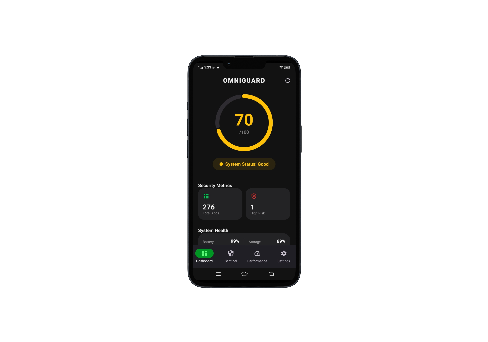
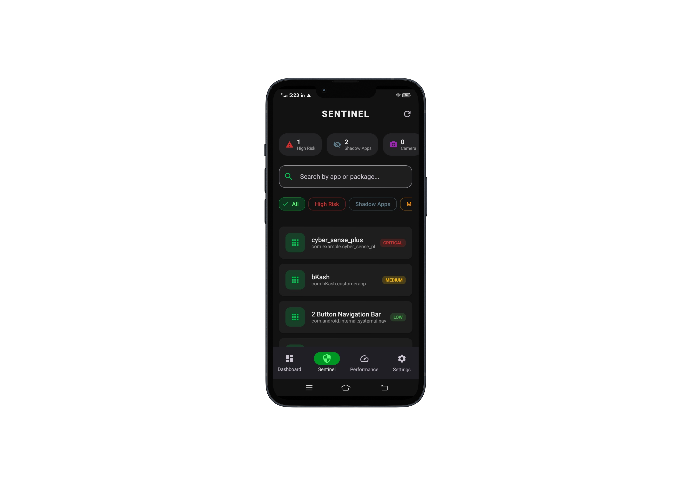
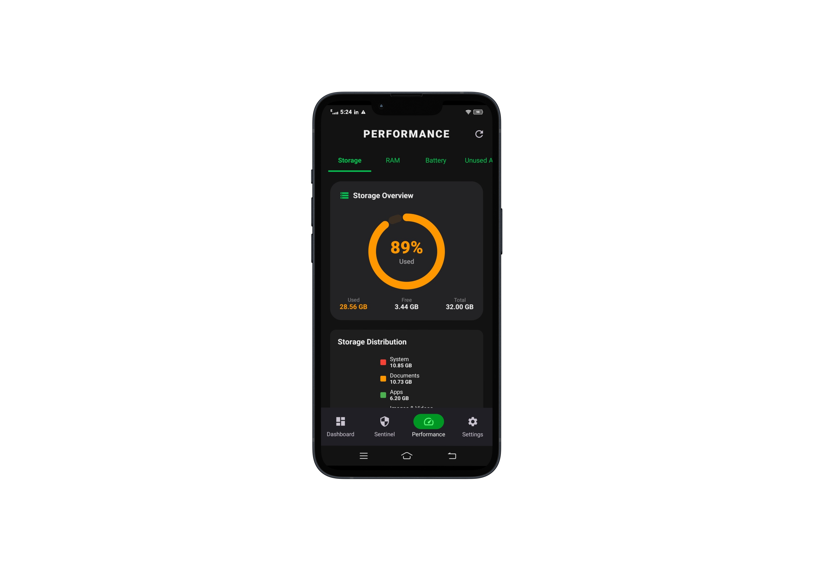
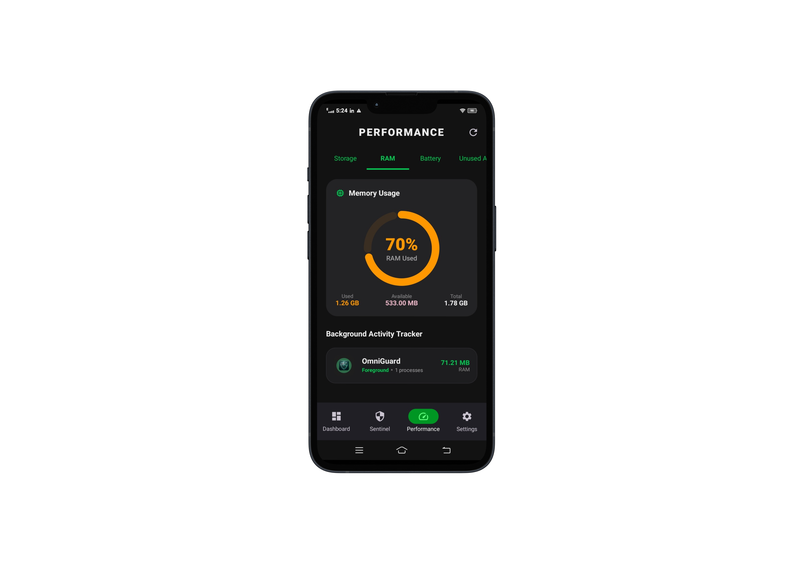
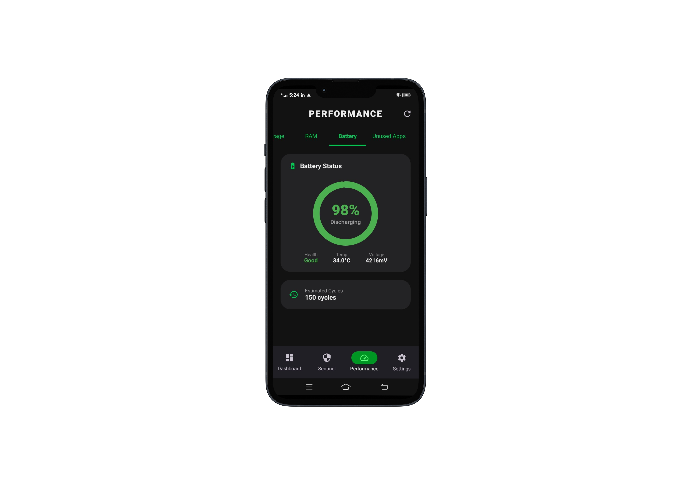
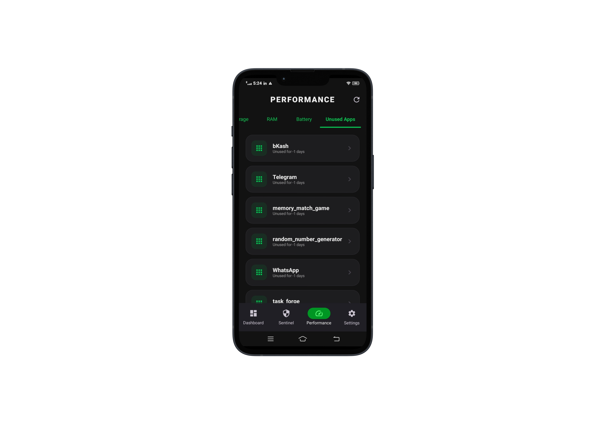
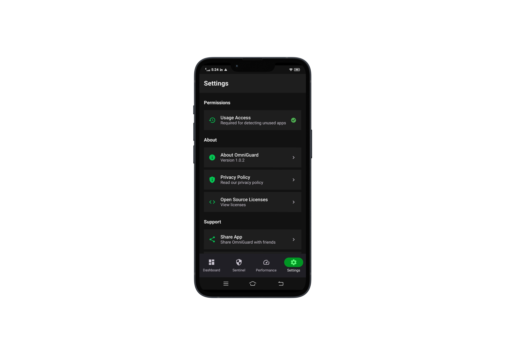
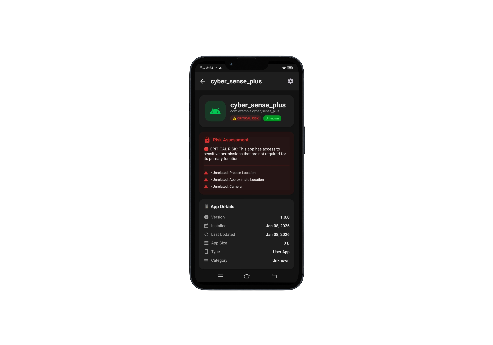
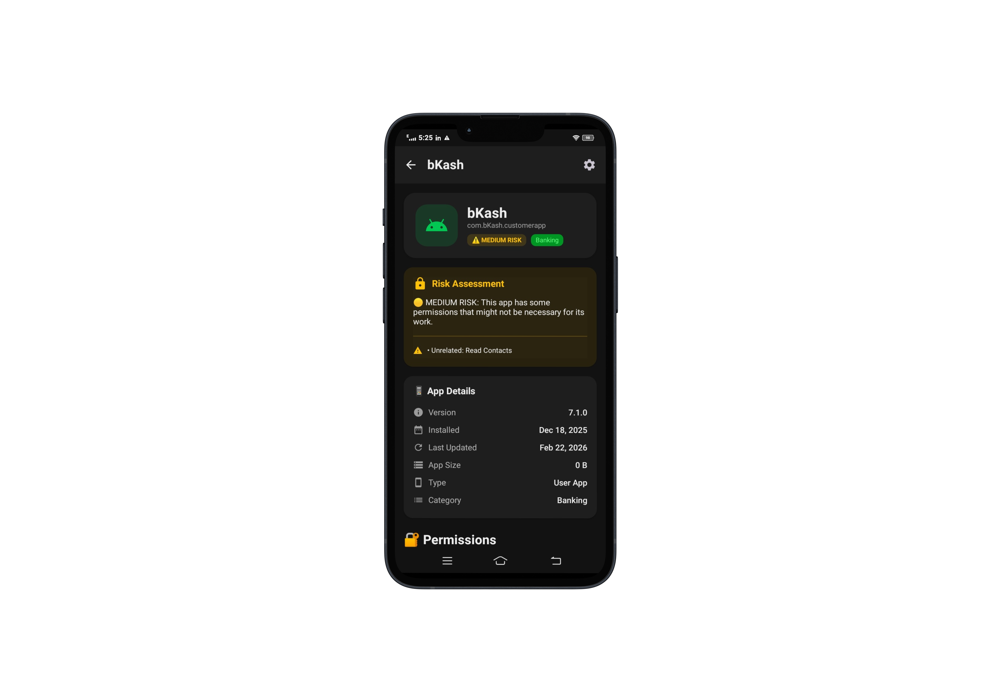

# 🔒 OmniGuard - Privacy Dashboard for Android

[](https://kotlinlang.org/)
[](https://developer.android.com/jetpack/compose)
[](https://dagger.dev/hilt/)
[](LICENSE)

**OmniGuard** is a privacy-first, read-only security dashboard for Android that helps you understand your digital footprint without overreaching permissions. It audits, monitors, and educates—but never modifies system files.

**Core Philosophy:** Show users exactly what's happening on their device. No cleaning. No modifying. Just transparency.

---

## 📱 Screenshots

<p align="center">
  
  
</p>

<p align="center">
  
  
</p>

<p align="center">
  
  
</p>

<p align="center">
  
  
</p>

<p align="center">
  
</p>
---

## ✨ Features

### 🔍 Privacy & Security
- **Permission Auditor** - Scan all installed apps and identify dangerous permissions (Camera, Microphone, Location, Contacts, SMS)
- **Shadow App Detector** - Detect hidden applications without launcher icons
- **Background Activity Tracker** - Monitor which apps are running in the background
- **Security Score Calculator** - Unified 0-100 security score based on device risk factors

### ⚡ Performance & Storage
- **Storage Insight** - Analyze storage usage by category (Apps, Images, Videos, Documents, Downloads, Audio)
- **Smart RAM Monitor** - Real-time memory usage with running processes
- **Unused App Suggester** - Identify apps not used in the last 30 days
- **Battery Health 360** - Monitor battery health, temperature, voltage, and charge cycles

### 🧠 AI-Powered Insights
- **ML App Categorizer** - Automatic categorization of apps (Social, Banking, Communication, etc.)
- **App Risk Scoring** - Risk badges (LOW/MEDIUM/HIGH/CRITICAL) for each app

### 🔒 100% Privacy First
- ❌ No file deletion or cleaning
- ❌ No cache clearing
- ❌ No system modifications
- ❌ No background app killing
- ❌ No cloud uploads of your data
- ✅ Zero telemetry
- ✅ Read-only operations

---

## 📋 Requirements

- **Minimum SDK:** Android 7.0 (API 24)
- **Target SDK:** Android 14 (API 34)
- **Compile SDK:** 34

---

🏗️ Architecture
Tech Stack
Layer	Technology
UI	Jetpack Compose (Material 3)
State Management	Kotlin Flow + StateFlow
DI	Dagger Hilt
Database	Room
Background Tasks	WorkManager
Charts	MPAndroidChart
Permissions	Accompanist Permissions
Async	Kotlin Coroutines

## 🏗️ Architecture

### Tech Stack

| Layer | Technology |
|---|---|
| UI | Jetpack Compose (Material 3) |
| State Management | Kotlin Flow + StateFlow |
| Dependency Injection | Dagger Hilt |
| Database | Room |
| Background Tasks | WorkManager |
| Charts | MPAndroidChart |
| Permissions | Accompanist Permissions |
| Async | Kotlin Coroutines |

### Project Structure

```text
app/src/main/java/com/example/omniguard/
├── di/
│   └── Dependency Injection modules
├── data/
│   ├── local/
│   │   └── Room database & entities
│   └── repository/
│       └── Repository implementations
├── domain/
│   ├── model/
│   │   └── Data models
│   └── usecase/
│       └── Business logic use cases
├── presentation/
│   ├── components/
│   │   └── Reusable Composables
│   ├── screens/
│   │   └── UI screens
│   ├── theme/
│   │   └── Material 3 theming
│   ├── navigation/
│   │   └── Compose Navigation
│   └── viewmodel/
│       └── ViewModels
├── service/
│   └── worker/
│       └── WorkManager workers
└── utils/
    └── Utility classes
```

UI Layer (Jetpack Compose)
        ↓
    ViewModel
        ↓
     UseCase
        ↓
   Repository
        ↓
   Data Source
        ↓
 Native Android APIs
 (PackageManager, etc.)

## 🔐 Permissions Required

| Permission | Purpose | User Benefit |
|---|---|---|
| `QUERY_ALL_PACKAGES` | Display all installed apps | See every app that might access your data |
| `PACKAGE_USAGE_STATS` | Identify unused apps | Find unused apps and manage storage |
| `READ_EXTERNAL_STORAGE` | Analyze storage usage | Understand what's taking up storage |
| `POST_NOTIFICATIONS` | Alert about security findings | Stay informed about privacy risks |

---

## 📊 Security Score Algorithm

### Base Score

```text
Base Score = 100
```

### Penalties

```text
├── -10  per app with always-on location permission
├── -5   per app with microphone access
├── -3   per app with camera access
├── -15  per detected shadow app
├── -20  per app with high background activity
├── -5   per unused app (30+ days)
└── -10  if storage is below 15% free
```

### Final Score

```text
Final Score = max(0, min(100, Base Score - Total Penalties))
```

### Score Interpretation

| Score | Rating | Message |
|---:|---|---|
| 90–100 | Excellent | Your device is very secure |
| 70–89 | Good | Some improvements possible |
| 50–69 | Fair | Security risks detected |
| 0–49 | Poor | Immediate attention needed |


CUET: 4th Year, CSE Department


## 📄 License

Copyright © 2026 Tanim Mahmud. All rights reserved.

This repository is publicly available for viewing and portfolio purposes.
The source code may not be copied, modified, distributed, or reused
without prior written permission.
